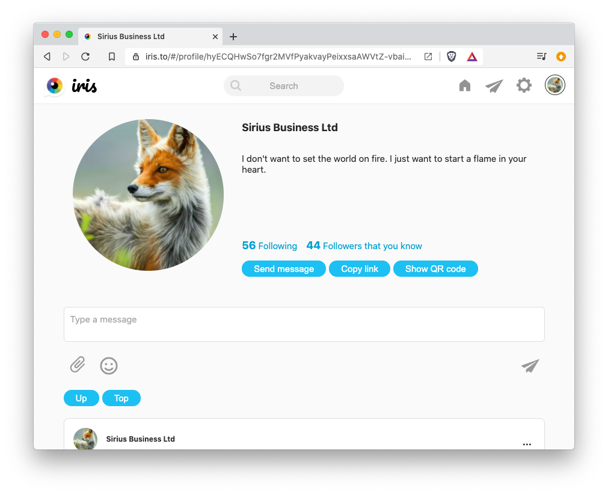

# Fluidi
Fluidi is an audio social experience. Fluidi is a fork of https://github.com/irislib/iris-messenger, with some changes to create unique user experience.
* No phone number or signup required. Just type in your name or alias and go!
* Secure: It's open source. Users can validate that big brother doesn't read your private messages.
* Available: It works offline-first and is not dependent on any single centrally managed server. Users can even connect directly to each other.



## Use
Browser application - https://chat.fluidi.xyz/

## Develop
``` bash
# install dependencies
yarn

# serve with hot reload at localhost:8080
yarn dev

# build for production with minification
yarn build

# test the production build locally
yarn serve

# run tests with jest and enzyme
yarn test
```

## Privacy (copied from Iris docs)
Private messages are end-to-end encrypted, but message timestamps and the number of chats aren't. In a decentralized network this information is potentially available to anyone.

By looking at timestamps in chats, it is possible to guess who are chatting with each other. It is also possible, if not trivial, to find out who are communicating with each other by monitoring data subscriptions on the decentralized database.

In that regard, Iris prioritizes decentralization and availability over perfect privacy.

Profile names, photos and online status are currently public. That can be changed when advanced group permissions are developed.

The application is an unaudited proof-of-concept implementation, so don't use it for security critical purposes.

## Contact
Join our [Discord](https://discord.gg/4Dgf54k).


